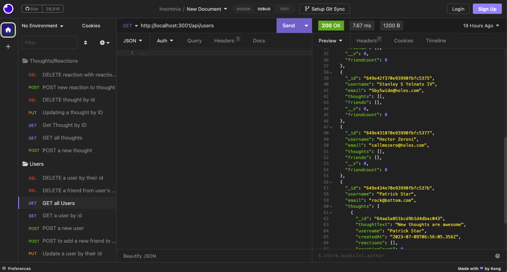

# social-network-api

## Description

This project is intended to be an API for a social network web application in which users can share their thoughts, add friends, and react to each others thoughts. This application also utilizies a MongoDB database to store users' information and friends. This application helped my understanding of how to make successful api calls based off of models set up to create the MongoDB database. This eliminates the need to hard code user information in a seeds file for example. It was also very helpful to have the ability to view database documents on MongoDB's Compass gui.

## Table of Contents

- [Installation](#installation)
- [Usage](#usage)
- [License](#license)

## Installation /
## Usage

Users will want to clone the repository containing the code for the web app to their local machine and open the code via VS code or IDE of choice. Then, through the integrated terminal the user will want to run npm i to install the needed dependencies for the application, after the dependencies are installed, the user will want to run node index.js to start the application on localhost: 3001. API calls can be made via insomnia and following the proper routes to make said calls.

    
## License

MIT Licensing information can be found in the LICENSE file associated with this repository.
